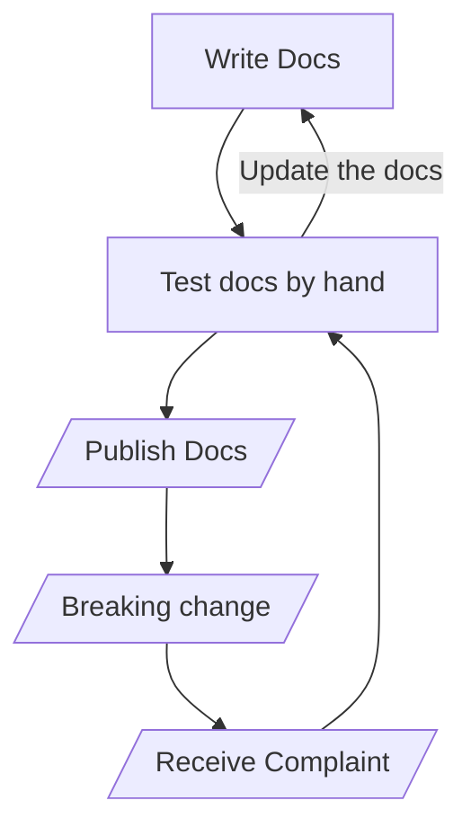
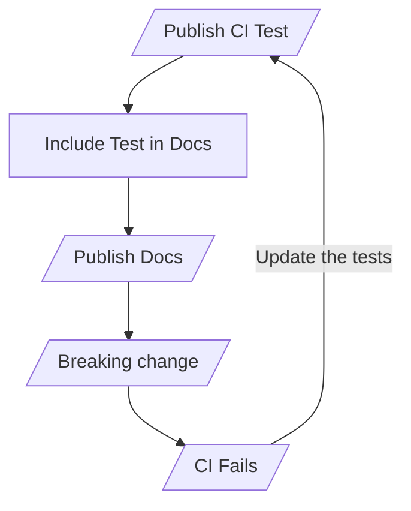
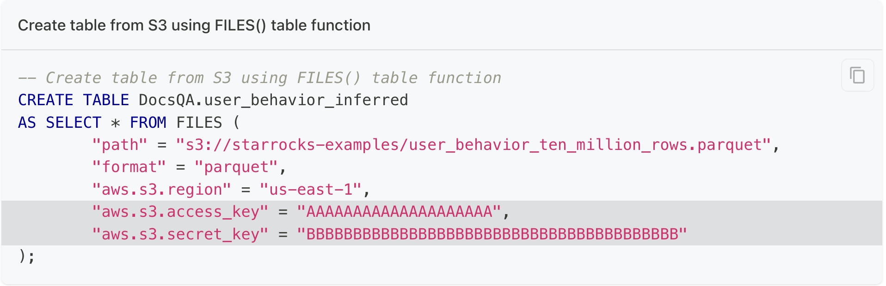

# Single sourcing documentation code snippets from end to end tests

The README is live at:
[https://danroscigno.github.io/SingleSourceCodeTestingAndDocs/]([https://danroscigno.github.io/SingleSourceCodeTestingAndDocs/docs](https://danroscigno.github.io/SingleSourceCodeTestingAndDocs/docs/setup))

## Two lifecycles for technical documentation

#### Documenting a feature

<table>
<tr>
<td> Production failure driven lifecycle </td> <td> CI test driven lifecycle </td>
</tr>
<tr>
<td>



</td>
<td><br/>



</td>
</tr>
</table>

## Overview/Rant

A year or two ago I saw a GitHub issue related to a bug in some documentation
that I wrote. Later in the same week I saw another issue about a different page
in the docs. Both of these issues were related to key features that the 
community and customers were using in production.

After retesting the steps in the docs and confirming that the issues were
accurate I looked through the release notes and found the related breaking
changes.

Waiting for the community and customers to find the bugs in the docs or bugs in
the code is a common problem, and it is embarrassing.

The best way to know when software changes is to run tests against every code
change. This is common for code changes, but somehow the code changes and sample
data used in the tests don't make their way into the documentation.

## The fix

- Treat the docs as code.
- As end to end docs (tutorials, quick starts, how to guides) are designed they
should be written as test plans.
- Automate the test plan.
- Write the doc, but instead of copy/pasting the code snippets (SQL in my case)
into the docs, import the snippets directly from the automated test.
- Run the test suite on a regular basis.
- As tests fail get the code fixed if the failure indicates a bug, or update the
test to include the new behavior of the system. The update to the test should cause
an update to the documentation as the doc system is pulling the code snippets
from the tests.

## Example

A recent feature of the project I am working on queries data in files stored
in object storage (for example, Amazon S3) figures out the schema of the data, then
creates and populates a table in a database.

The SQL that causes this magic to happen looks like this:

```sql
-- Create table from S3 using FILES() table function
CREATE TABLE DocsQA.user_behavior_inferred
AS SELECT * FROM FILES (
	"path" = "s3://starrocks-examples/user_behavior_ten_million_rows.parquet",
	"format" = "parquet",
	"aws.s3.region" = "us-east-1",
	-- highlight-start
	"aws.s3.access_key" = "AAAAAAAAAAAAAAAAAAAA",
	"aws.s3.secret_key" = "BBBBBBBBBBBBBBBBBBBBBBBBBBBBBBBBBBBBBBBB"
	-- highlight-end
);
```

Yesterday I would have copied the above out of the SQL client I used to run
the query and pasted it into a Markdown file. But today I would instead use
this syntax to grab the above from the test specification like so:

<pre>
```sql reference title="Create table from S3 using FILES() table function"
https://github.com/DanRoscigno/docs/blob/6d6fcf905162adf80bd094cb9dd133a5c557bdd3/SQL/files_table_fxn.sql#L1-L11
```
</pre>

In the docs this looks like:



## Components

The documentation in this proof of concept repository is generated with 
[Docusaurus version 3](https://docusaurus.io/).

The sample tests are run against the StarRocks database and the testing system
is built with [Golang, Ginkgo, and Gomega](https://onsi.github.io/ginkgo/).

Code snippets are imported from the tests using [`docusaurus-theme-github-codeblock`](https://github.com/christian-bromann/docusaurus-theme-github-codeblock/blob/main/README.md)

## Running the system

1. Clone this repo
2. Build the Ginkgo container

```bash
cd ci
docker build -f ginkgo.Dockerfile -t ginkgo .
```

3. Start StarRocks

```bash
docker compose --profile starrocks up --detach --wait --wait-timeout 60
```

4. Run the tests

```bash
docker compose run test-harness
```

## Add a new test

To test the basic [quickstart](https://docs.starrocks.io/docs/quick_start/shared-nothing/)

```bash
ginkgo generate quickstart_basic
```
